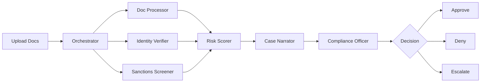

# KYC/AML Operations Orchestrator

> **TL;DR** — When someone opens a new account at a financial institution, a compliance officer has to verify their identity, screen them against sanctions lists, assess risk, and write up a case report. This takes **4+ hours per case** and involves reading hundreds of pages. This project replaces that manual grind with a team of AI agents that do it all in **~3 minutes** — the officer just reviews the synthesized report and makes the call.

Built for the [Wealthsimple AI Builders](https://www.wealthsimple.com/) program.

## The Problem

Every bank and fintech must run Know Your Customer (KYC) and Anti-Money Laundering (AML) checks before onboarding a new client. Today, that looks like this:

1. **Document review** — A compliance officer manually reads passports, utility bills, corporate filings, and bank statements to extract names, addresses, dates of birth, and document numbers.
2. **Sanctions screening** — They cross-reference the applicant against UN, OFAC, and other sanctions lists, checking for name variations and aliases.
3. **Risk assessment** — They weigh all the signals (document quality, jurisdiction risk, PEP status, sanctions hits) and assign a risk level.
4. **Case write-up** — They write a narrative summarizing their findings, linking to evidence, and recommending approve/deny/escalate.

This is slow (days per case), repetitive, and error-prone. Compliance teams are chronically understaffed. The work is mostly cognitive drudgery — exactly what AI is good at.

## The Solution

This system orchestrates **5 specialized AI agents** that work in parallel to handle steps 1–4 automatically. A compliance officer reviews the final output — a synthesized risk profile with linked evidence — and makes the human judgment call (approve, deny, or escalate).

The AI does the reading. The human makes the decision.



## Agents

| Agent | Role | Technology |
|-------|------|------------|
| **Document Processor** | OCR on passports, IDs, utility bills; extracts structured data with confidence scores | Mistral OCR |
| **Identity Verifier** | Cross-references extracted identity data against verification sources | Gemini 2.5 Pro |
| **Sanctions Screener** | Screens against real UN Security Council and OFAC SDN sanctions lists | Gemini 2.5 Pro + fuzzy matching |
| **Risk Scorer** | Aggregates all agent signals into a composite risk score (0-100) | Deterministic engine |
| **Case Narrator** | Generates a human-readable risk assessment narrative with linked evidence | Gemini 2.5 Pro |

## Tech Stack

- **LLM**: Gemini 2.5 Pro via Google GenAI SDK
- **OCR**: Mistral OCR API
- **Frontend**: Next.js 15, shadcn/ui, Framer Motion
- **Backend**: Supabase (PostgreSQL + Storage)
- **Deployment**: Vercel

## Getting Started

### Prerequisites

- Node.js 18+
- npm
- Supabase account (free tier)
- Gemini API key
- Mistral API key

### Setup

```bash
# Clone the repo
git clone https://github.com/kurtjallo/wealthsimple-ai-builders.git
cd wealthsimple-ai-builders

# Install dependencies
npm install

# Copy environment variables
cp .env.example .env.local

# Fill in your API keys in .env.local:
# - NEXT_PUBLIC_SUPABASE_URL
# - NEXT_PUBLIC_SUPABASE_ANON_KEY
# - SUPABASE_SERVICE_ROLE_KEY
# - GEMINI_API_KEY
# - MISTRAL_API_KEY

# Run the dev server
npm run dev
```

Open [http://localhost:3000](http://localhost:3000).

## Key Design Decisions

**Human-in-the-loop by design.** AI never makes final account decisions. Approve, deny, and escalate actions are exclusively available to the compliance officer. STR (Suspicious Transaction Report) filing remains human-only per FINTRAC requirements.

**Real data, not simulations.** Documents are processed through actual Mistral OCR. Sanctions screening runs against real UN and OFAC lists. No mock APIs.

**Deterministic scoring.** The risk scoring engine is a pure function — same inputs always produce the same score. The LLM only generates the qualitative narrative, not the numbers. Fully auditable.

**Defense in depth for compliance.** Human-in-the-loop is enforced at three layers: UI (buttons disabled for AI), API (server-side guards reject unauthorized decisions), and audit (every action logged with timestamp, actor, and justification).

## Regulatory Compliance

- **FINTRAC/PCMLTFA**: Audit trail meets record-keeping requirements. STR filing is exclusively human.
- **OSFI E-23**: AI assists but never executes material decisions.
- **CIRO**: Human suitability determinations preserved.

## Project Structure

```
src/
  app/                    # Next.js app router
    api/                  # API routes (cases, agents, audit)
    dashboard/            # Compliance officer dashboard
  components/
    ui/                   # shadcn/ui components
    cases/                # Case queue, risk profile, decisions
    pipeline/             # Agent visualization components
    audit/                # Audit trail viewer
    layout/               # Dashboard shell, sidebar, header
  lib/
    agents/               # Agent implementations (orchestrator, processors)
    pipeline/             # Case processing pipeline
    audit/                # Audit logging system
    supabase/             # Database client and helpers
    demo/                 # Demo data seeding
  types/                  # TypeScript domain types
```

## License

MIT
